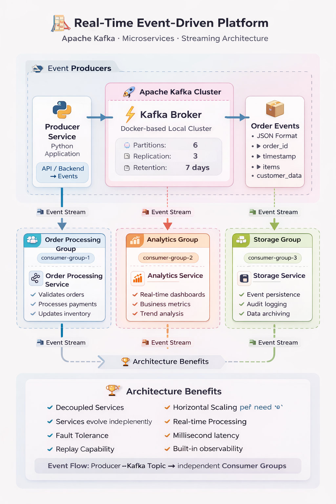
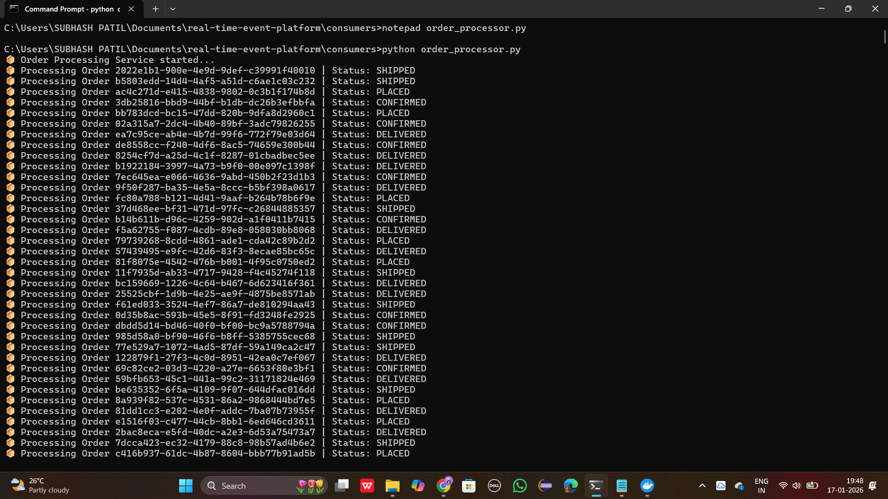

# 🚀 Real-Time Event-Driven Order Processing Platform

A **distributed, event-driven system** that processes real-time order events using **Apache Kafka**.
Built with **Python**, powered by **Docker**, and designed using **industry-grade architecture patterns**.

<p align="center">
  
</p>

<p align="center">
  
  
  
  
  
</p>

---

## 🌐 Real-World Inspiration

This project follows the **same architectural pattern** used by platforms like:

🚕 **Uber** – ride events
🛒 **Amazon** – order lifecycle events
🍔 **Swiggy/Zomato** – delivery updates
📸 **Instagram** – activity & notification streams

> 💡 *Kafka acts as the backbone that connects independent services in real time.*

---

## 🚀 About the Project

This system simulates how **real-world backend systems** handle continuous streams of events.

### ✔ What it demonstrates

* Kafka **Producer–Consumer** model
* **Multiple consumers** reading the same topic
* **Consumer groups** for scalability
* **Decoupled microservice-style design**
* Real-time **analytics & persistence**

> 🔥 Biggest learning: *Sometimes setting up Kafka is harder than writing the business logic — but that’s where real learning happens.*

---

## 🏗️ System Architecture

```
Producer Service
      │
      ▼
Kafka Topic (order-events)
      │
      ├── Order Processing Service
      ├── Analytics Service
      └── Storage Service
```

✔ One producer
✔ One Kafka topic
✔ Multiple independent consumers
✔ Each consumer has a **separate responsibility**

---

## 📦 Event Schema (Order Event)

```json
{
  "event_type": "ORDER_EVENT",
  "order_id": "uuid",
  "user_id": "user_123",
  "status": "PLACED | CONFIRMED | SHIPPED | DELIVERED",
  "timestamp": "ISO-8601 datetime",
  "source": "WEB | MOBILE | API"
}
```

---

## 🧩 Services Overview

### 📤 Producer Service

* Generates real-time order events
* Publishes structured JSON messages to Kafka

### 📦 Order Processing Consumer

* Processes order status changes
* Simulates backend order handling logic

### 📊 Analytics Consumer

* Tracks order status counts in real time
* Represents monitoring & analytics systems

### 💾 Storage Consumer

* Persists events into a file
* Simulates database or audit log storage

---

## 🖼️ Screenshots & Results

<p align="center">
  
</p>

<p align="center">
  
</p>

<p align="center">
  
</p>

<p align="center">
  
</p>


---

## 🚀 How to Run the Project

### 1️⃣ Start Kafka (Docker)

```bash
docker start kafka
```

### 2️⃣ Run Producer

```bash
cd producer
python producer.py
```

### 3️⃣ Run Consumers (open separate terminals)

```bash
cd consumers
python order_processor.py
python analytics_service.py
python storage_service.py
```

---

## 🧠 Key Learnings

✨ Apache Kafka fundamentals
✨ Event-driven architecture
✨ Consumer groups & scalability
✨ Distributed system debugging
✨ Docker-based Kafka setup
✨ Real-world backend design patterns

---

## 🛠️ Software & Tools Requirements

1. [GitHub Account](https://github.com)
2. [Docker Desktop](https://www.docker.com/products/docker-desktop/)
3. [Python 3.8+](https://www.python.org/)
4. [Apache Kafka (via Docker)](https://kafka.apache.org/)
5. [VS Code](https://code.visualstudio.com/)

---

## 🔮 Future Enhancements

🚀 Persist events to MongoDB / PostgreSQL
🚀 Add REST API using FastAPI
🚀 Real-time dashboard (Grafana / Streamlit)
🚀 Kafka Streams processing

---

## 👩‍💻 Author

**Ankita Patil**
💡 Built as a hands-on project to deeply understand
**Apache Kafka and Event-Driven Distributed Systems**

⭐ If you like this project, consider giving it a star!

---

## 📸 WHAT YOU NEED TO DO NOW (VERY SIMPLE)

1. Create folder:

```bat
mkdir screenshots
```

2. Add screenshots:

* `producer.png`
* `order_processor.png`
* `analytics.png`
* `storage.png`
* `architecture.png` (optional – I can design this for you)

3. Push:

```bat
git add .
git commit -m "Improve README with screenshots and badges"
git push
```
This project is not just a Kafka demo, but a real-world simulation of how modern backend systems work at scale.

If you’re a beginner learning Kafka — this project proves you don’t need years of experience to think like a system designer.
